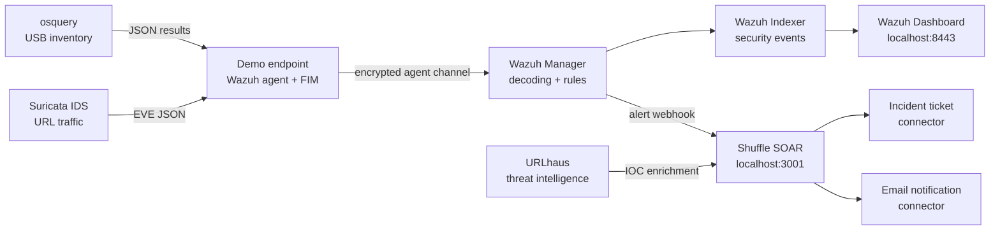

# Architecture

Every component joins the `security-assessment-net` bridge and uses Compose DNS. There are no host-port dependencies between components. Dashboard TLS uses a generated local certificate.

For a 100-employee production deployment, use actual endpoint agents, clustered Wazuh components, redundant isolated Shuffle workers, authenticated TLS ingress, and immutable off-host backups.

